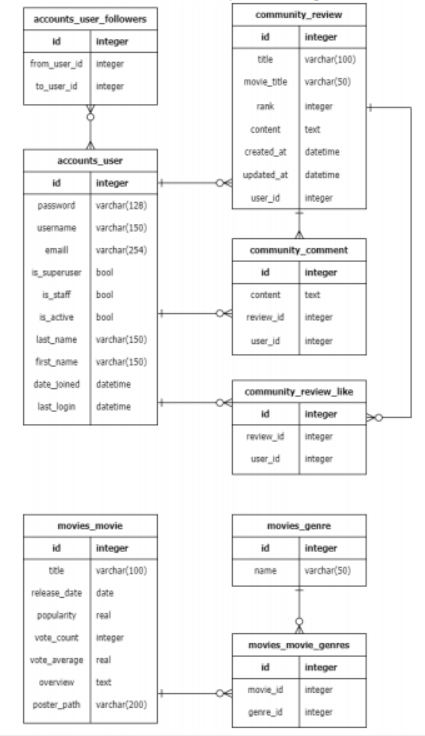
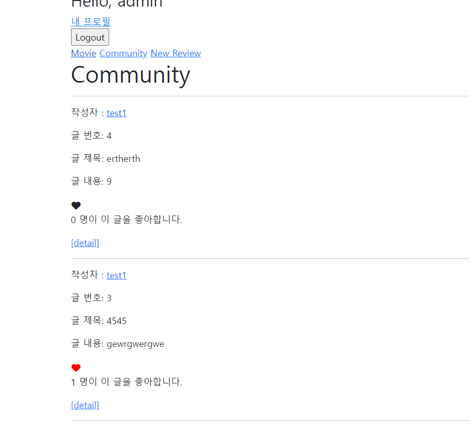
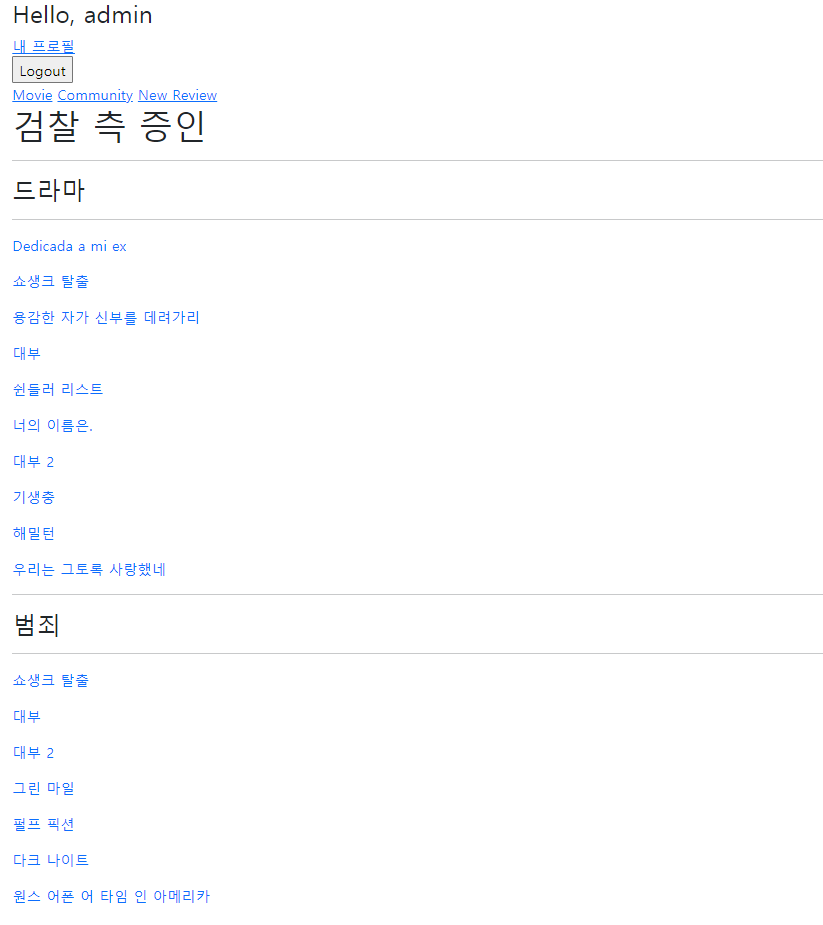

## 이번 ptj를 통해 배운 내용

- AJAX를 이용한 팔로우 기능 구현
- 웹 애플리케이션에 M;M 데이터 적용시키기 및 영화 추천 목록 출력 기능 구현하기

- Django로 페이지네이션 효과 구현하기

- 깃 브랜치를 활용한 페어 프로젝트 진행하기

### 목표

- 데이터를 생성, 조회, 수정, 삭제할 수 있는 Web Application 제작 
- AJAX 통신과 JSON 구조에 대한 이해 
- Database 1:N, M:N 관계의 이해와 데이터 관계 설정
- 영화 추천 알고리즘 설계

### 개발도구

- Visual Studio Code
- Google Chrome Browser
- Django 3.2+

### 요구사항 

- 커뮤니티 서비스의 상세 기능 개발을 위한 단계로, 비동기 통신(AJAX)을 활용하여 사용자의
  UI/UX를 개선합니다.

### Model



### 프로젝트 진행

##### 프로젝트는 전반적으로 기능을 구현하며 커밋을 진행했으므로, 커밋 순서에 따라서 진행을 서술하겠습니다.

페어와 브랜치를 이용해서 협업을 진행했습니다.


### 영화 메인 페이지 (김동완)

- 영화 메인페이지는 loaddata로 제공된 데이터를 이용해서 구축했으며, for문을 이용해 간단히 영화 제목과 overview가 표시되게 했습니다. 영화 줄거리 하단에는 anchor 태그를 이용해 detail로 들어갈 수 있게 구성했습니다.


### 영화목록 페이지네이션 기능 및 디테일 페이지 (장진세)

- Django.core.pagination 모듈에서 Paginator를 가져와서 사용
- object로 가져온 영화목록을 Paginator를 통해 구현
- django-bootstrap 라이브러리 활용하여 꾸밈


- 디테일 페이지에는 좌측에 포스터 오른쪽에는 제목과 개봉일, 점수, 줄거리, 장르등이 나타나도록 꾸밈
- 영화와 장르가 M:N 관계이기 때문에 이를 나타내기 위해 많은 고민을 하였다.

### 유저 팔로우 기능(장진세)

- 팔로우 여부를 체크하기 위한 liked 변수를 새로 설정
- followings필드를 참조 , 역참조한 것들의 원소의 개수를 카운트하여 각각 변수에 저장
- 팔로우 기능을 맡고있는 form태그를 지정하여 이벤트리스너를 추가하고 preventDefault로 작동시 화면이 전환되는 것을 방지한다.
- 그리고 axios를 통해 post 메소드, url, csrf 토큰을 설정
- .then으로 이후의 팔로우 토글 및 숫자 출력 기능을 스크립트로 구현
- liked 값에 따라 팔로우 버튼 클릭시 상태가 토글되도록 하고 팔로잉,팔로워 카운트 값을 받아 해당 값을 나타내는 태그의 텍스트 값을 변경해준다.

- axios와 .then을 잘못 사용하여 발생한 오류를 페어와 협력하여 해결하였다.
- 콘솔로 값을 일일히 찍어보면서 디버깅을 하는 것이 문제를 해결하는데 기본적이면서도 중요한 열쇠가 되었다.


### 리뷰 좋아요 기능 (김동완)

#### 기본 구성 

- 좋아요를 누를 때 새로고침을 방지하기 위해 vanila js를 사용했습니다.
- js에 데이터를 전송할 때는 태그 내부에 data-review-pk 형식을 사용해서 review를 pk로 구분하게 했습니다.
- js에서 쿼리를 선택하고 csrf토큰을 전송했으며 좋아요 form을 foreach문을 통해 구분하게 했습니다.
- post 형태로 url에 요청을 보내 전송된 응답에 따라 like의 형태를 다르게 지정했습니다.
- 추후 기능이 구현 된 후 fontawesome을 이용해 하트의 형식을 예쁘게 변경했습니다.



#### Pagination

- 오늘 학습한 인피니티 스크롤을 구현하려 노력했으나, 두가지 이유로 실패했습니다.
  - 먼저 인증되지 않은 유저일경우 좋아요 버튼이 나오지 않게 설계했기 때문에, js상에서 오류가 발생했습니다.
  - button을 각 page를 추가할 때마다 갱신하기 위해 JS에 innerHtml을 줘야하는데, innerHtml은 권장되지 않는 사항이고, 해당 기능을 구현하기까지 시간이 많이 소요될 것이라고 판단되어, 간단한 pagination을 이용했습니다.
- pagination은 django.core.paginator을 이용했으며, 각페이지마다 5개의 리뷰가 표시하게 진행했습니다.
- 버튼은 부트스트랩을 이용하고, flex 옵션을 줘서 정렬했습니다.

#### 어려웠던 점 

- js에서 auth를 통해 분기처리

  - 교수님께 질문해서 stackoverflow에서 구분 코드를 찾았으나 시간적 여유가 없어 구현하지 못해 다음에 해보려고 합니다!

  ```javascript
        var user_is_authenticated = {{ request.user.is_authenticated|yesno:"true,false" }};
        if (user_is_authenticated === true) {
          console.log('true')
        }
        else {
          console.log('false')
        }
  
  ```

### 영화 추천 기능 (김동완)

- 영화 추천기능 목표는 유저가 선택한 영화의 장르를 기반으로 해당 장르에 속하는 영화들을 10개씩 추천해주는 것이었습니다.
- recommend 페이지에 movie_pk를 받아서, 해당 영화를 main_movie로 정의하고, 해당 영화의 장르들을 genres로 저장했습니다.
- recommend_movies라는 딕셔너리를 만들고 장르를 키로 속하는 영화 최대 10개를 value로 딕셔너리를 구성했습니다.
  - 영화 10개는 vote_average순으로 정렬했습니다. (높은 순으로 역정렬 )
- 해당 추천영화 정보를 context로 넘겼으며, recommend 페이지에서 볼 수 있게 했습니다. 

```python
def recommended(request,movie_pk):
    main_movie = get_object_or_404(Movie,pk=movie_pk)
    genres = main_movie.genres.all()
    recommend_movies = {}
    for genre in genres :
        recommend_movies[genre] = get_list_or_404(Movie.objects.order_by('-vote_average'),genres=genre.pk)[:10]
    context = {
        'movies':recommend_movies,
        'main_movie':main_movie
        }
    
    return render(request,'movies/recommended.html',context)

```


#### 어려웠던 점 

- 딕셔너리 형태의 context를 django html에서 표시하는 방법 

  - 구글링과 이야기를 나누면서 하나씩 시도해본 결과 해결할 수 있었습니다.

  ```django
   #movies 딕셔너리의 item을 순회하며 
      <h3>{{key}}</h3>#key 뽑기 
  
      <hr>
       #value를 순회하며 
        <p>{{value.title}}</p> #title 뽑기 
       
      <hr>
  
  ```

  



### 영화 추천 페이지 마무리하기 (장진세)

- 어떤 영화를 선택 -> 해당 영화와 겹치는 장르를 선택하여 추천 하는 구조이기 떄문에 DETAIL 페이지에서 현재 영화 id를 받아 바로 추천 페이지로 넘어가는 링크를 적당한 위치에 생성 
- 추천받은 영화 목록의 가시성을 높이고 영화 제목을 클릭하면 해당 영화의 상세 정보로 넘어가도록 링크를 설정


### 느낀점 

#### 김동완

- 페어와 함께 branch를 이용해 업무를 나누고 merge 했습니다.
- branch 작업에 대한 두려움이 있었지만, 막상 해보니 몇가지 사항을 조심하면 쉽게 사용할 수 있다는 것을 알 수 있었습니다.
  - 같은 파일은 공동작업할 때 무조건 confict가 발생하니 규칙을 정하거나 자제하기
  - 브랜치로 작업할 때 commit, push에서 현재 브랜치 잘 확인하기
  - 브랜치로 작업할 때 내가 맡은것 이외에 파일에 접근할 때 (base.html 등) 서로 이야기해서 confilct 방지하기
- 나름의 아이디어 공유를 통해 영화 추천을 기능한 것이 재밌었습니다. 기회가 된다면 다양한 API를 이용해 더 많은 방법을 시도해보고 싶습니다. (날씨기반, 등등..)

#### 장진세

- 어설프게나마 깃을 활용하여 페어를 진행해보니 약간의 난관이 있었다.

- 역할을 잘 정해서 브랜치를 정확하게 쓰도록 하면 문제가 발생하지 않을거라 생각하였지만 큰 오산이었고 이를 통해 깃을 더 능숙히 다룰 수 있어야 겠다고 생각하였다.

- 페이지네이션으로 게시판의 기능을 장식하거나 각종 페이지들이 서로 연결되어 각각의 기능을 하도록 만드는 과정이 꽤나 재밌었다.